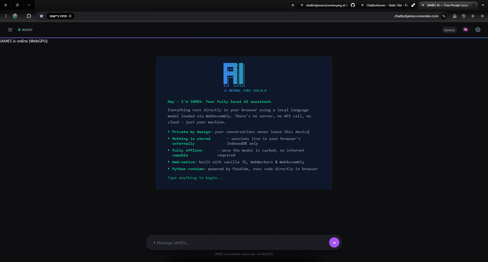

<h1 align="center">JAMES AI</h1>

<p align="center">
  <strong>A 100% Free, Private, Local AI Chatbot running entirely in your browser.</strong>
</p>

<p align="center">
  
</p>

## Overview

JAMES (Just Another Marvelous Expert System) is a powerful, client-side AI assistant designed to run directly in your web browser. By leveraging **WebGPU** and **WebAssembly**, JAMES brings the power of Large Language Models (LLMs) locally to your machine without requiring expensive backend servers, API keys, or active internet connections for core inference.

Your conversations never leave your device. 

## Features

- 🔒 **100% Private & Local:** All AI inference happens securely on your device's GPU.
- ⚡ **WebGPU Accelerated:** Optimized for high-performance generation in modern browsers.
- 🐍 **In-Browser Python Execution:** Run Python code securely in the browser via Pyodide for data processing, math, and algorithms.
- 🌐 **Web Search Capabilities:** Live web search across Google, DuckDuckGo, and Bing for up-to-date information.
- ♟️ **Interactive Games:** Play full games of Chess and Checkers directly against the AI in the chat interface.
- 🛠️ **Rich Tool Ecosystem:** Over 15 built-in utilities including weather, currency conversion, calculator, timezone lookups, UUID and password generation, ASCII art, Base64 encoding, hashing (MD5/SHA), color conversions, IP lookups, and more.
- 💾 **Persistent History:** Chats are saved seamlessly and instantly to your browser's IndexedDB.
- 🎨 **Robust Markdown Rendering:** Beautiful syntax highlighting, tables, and rich text powered by `marked.js` and secured by `DOMPurify`.
- 📱 **PWA Ready:** Install JAMES as an app for full offline access.

## How It Works

JAMES uses [Transformers.js](https://github.com/xenova/transformers.js) mapped to a dedicated Web Worker (`worker.js`) to load and run quantized models directly into your browser's memory. It intelligently routes your requests, managing state, background tasks, and UI rendering asynchronously to keep your browser snappy.

## Installation & Setup

Since JAMES is a client-side application, running it locally is incredibly simple:

1. **Clone the repository:**
   ```bash
   git clone https://github.com/yourusername/chatbotjames.git
   cd chatbotjames
   ```

2. **Serve the directory:**
   You can use any local web server. For example, using Python:
   ```bash
   python -m http.server 8000
   ```
   Or using Node.js:
   ```bash
   npx serve .
   ```

3. **Open your browser:**
   Navigate to `http://localhost:8000`. 
   
   *Note: For the best performance, ensure you are using a modern browser with WebGPU enabled (like Chrome 113+ or Edge).*

## Architecture

- `app.js`: Main UI controller, chat state management, and tool routing.
- `worker.js`: Dedicated Web Worker handling model initialization, prompt construction, LLM inference, and tool execution.
- `message-renderer.js`: Safely formats and renders LLM outputs into rich HTML using DOMPurify and Marked.js.
- `chat-db.js`: Handles async storage of chat history into IndexedDB.
- `game-logic.js` & `game-ui.js`: Custom engines and UI renderers for interactive in-chat games.

## Privacy

Because JAMES runs locally, it inherently respects your privacy. Chat histories, tool outputs, and generated text are stored strictly on your local disk using standard browser storage APIs. 

## Contributing

Contributions are very welcome! If you have an idea, found a bug, or want to add a new tool or feature:
1. Check the [Issues](https://github.com/tripping-alien/chatbotjames/issues) tab to see if it's already being discussed.
2. To report a bug or request a feature, please [open a new Issue](https://github.com/tripping-alien/chatbotjames/issues/new).
3. To submit code, fork the repository, create a branch, make your changes, and [submit a Pull Request](https://github.com/tripping-alien/chatbotjames/pulls).

## License

MIT License

---
*Created by Andrey Lopukhov*
